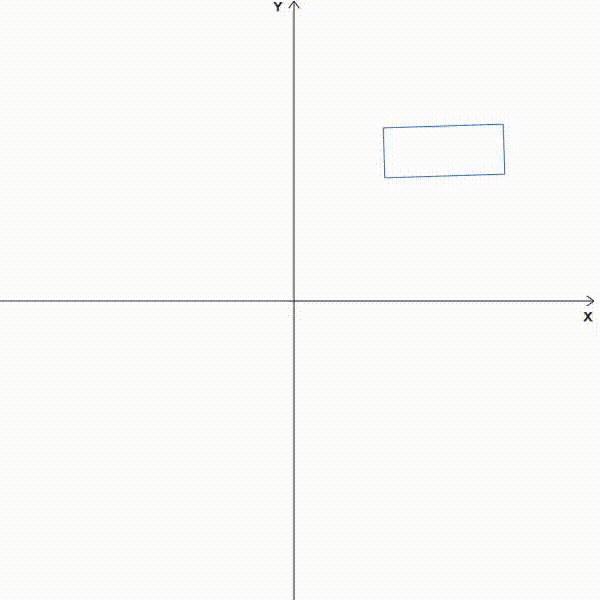
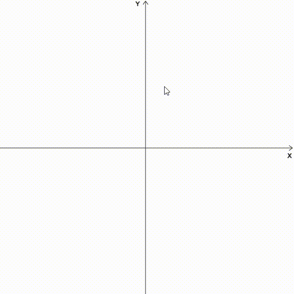
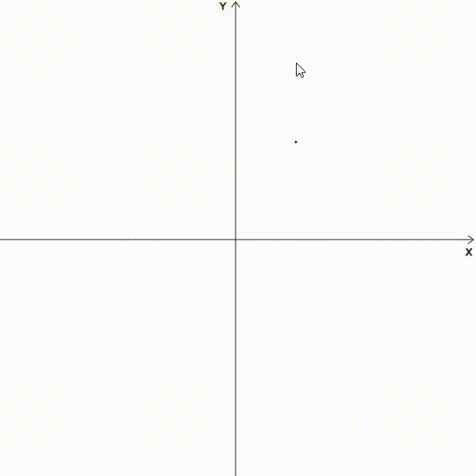
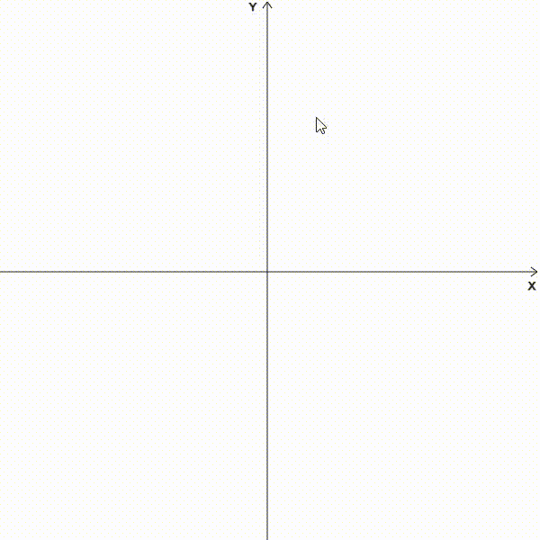

# proto-engine

This project is a study about math and physics for games using javascript and [p5.js](https://p5js.org/) library. That said, the purpose of this project is to create a visual representation of linear algebra foundation. Some topics covered in this project are:

- [Vector](https://en.wikipedia.org/wiki/Vector_(mathematics_and_physics)) 
- [Matrices](https://en.wikipedia.org/wiki/Matrix_(mathematics))
- [Line Intersection](https://en.wikipedia.org/wiki/Line%E2%80%93line_intersection)
- [Bounding Volumes](https://en.wikipedia.org/wiki/Bounding_volume)
- [Collision Detection](https://en.wikipedia.org/wiki/Collision_detection)
- [Separating Axis Theoream](https://en.wikipedia.org/wiki/Hyperplane_separation_theorem#:~:text=The%20separating%20axis%20theorem%20(SAT,convex%20solids%20intersect%20or%20not.))

## Exemples

<table cellspacing="0" cellpadding="0">
  <tr>
    <td></td>
    <td></td>
  </tr>
  <tr>
    <td></td>
    <td></td>
  </tr>
